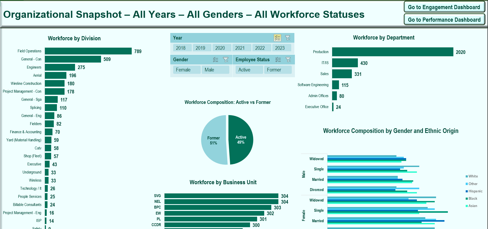
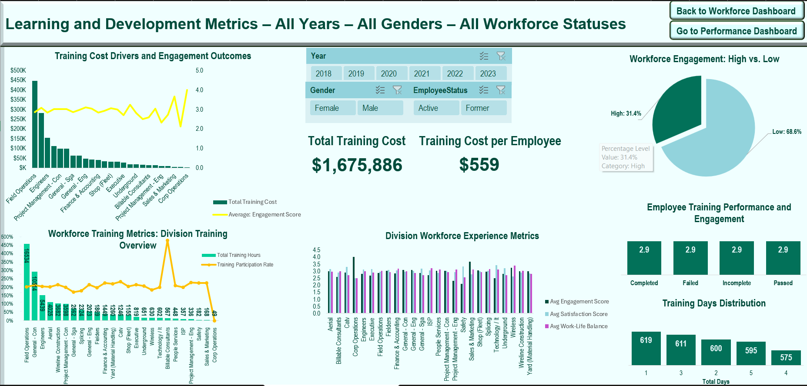
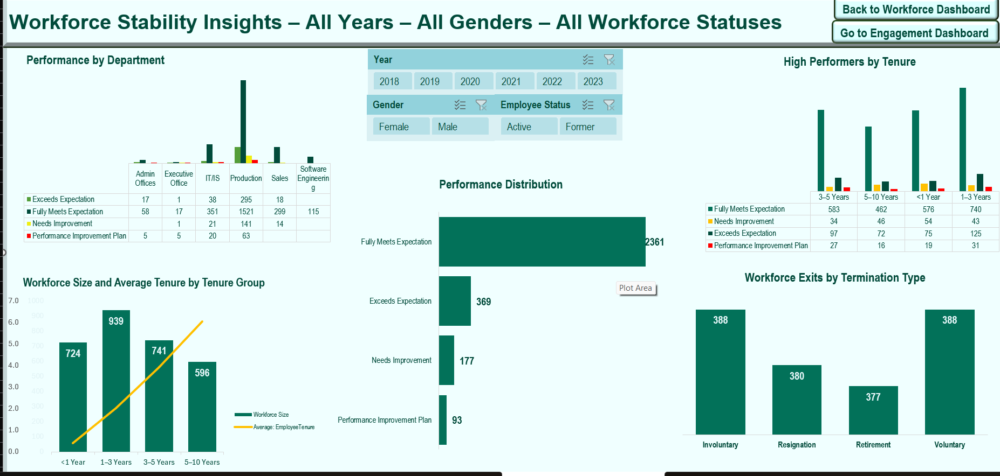

# HR Analytics Dashboard

**Interactive Excel dashboard visualizing workforce demographics, training outcomes, performance, satisfaction, work–life balance, and a training cost KPI.**

---

##  Motivation  
This dashboard consolidates essential HR insights—demographics, training analytics, performance trends, engagement, and retention—in one interactive tool. It’s designed to empower HR professionals and decision-makers with a comprehensive, visual, and easily accessible overview.

---

##  Features

| Dashboard                   | Highlights                                                                               |
|-----------------------------|------------------------------------------------------------------------------------------|
| **Workforce Overview**      | Visualize composition, distribution, and tenure by division and department               |
| **Engagement & Training**   | Explore training costs, participation rates, outcomes, and satisfaction across divisions |
| **Performance & Retention** | Analyze performance score distribution and retention trends over time                    |

---

## Screenshots
 **Workforce Overview**

**Engagement & Training**

**Performance & Retention**

---

##  Download

The latest version of the **macro-enabled** Excel dashboard is available here:

---

##  Getting Started

### Prerequisites  
- Microsoft Excel (**desktop version recommended**)—macros may not work correctly in Excel Online.

### How to Use  
1. Download the `.xlsm` workbook (see link above).  
2. Open it in Excel (desktop recommended).  
3. Begin with the **Introduction** sheet to access the interactive dashboards.

---

##  File Type Note: `.xlsm` & GitHub Repository Management

- Excel macro-enabled files (`.xlsm`) are fully supported in GitHub—users can download and open them without issue. GitHub handles `.xlsm` files like any other binary file.

## Enabling Macros for Full Dashboard Functionality

When downloading the HR Analytics Dashboard from GitHub, Excel may block macros due to security settings, especially if the file is from an untrusted source. To ensure the dashboard functions correctly, please follow these steps:

1. Download the Excel File:

	- Click the download link provided in the repository.

2. Unblock the File:

	- Navigate to the folder where the file is saved (e.g., Downloads).

	- Right-click the .xlsm file and select Properties.

	- In the General tab, check the box labeled Unblock.

	- Click Apply, then OK.

3. Open the Workbook:

	- Double-click the file to open it in Excel.

	- If prompted with a security warning, click Enable Content to allow macros to run.

By unblocking the file, you remove the "Mark of the Web" (MOTW) tag, which Excel uses to identify files downloaded from the internet. This action ensures that macros can execute without restrictions.  

  ---

- **Limitations in version control:**  
  Since `.xlsm` is a binary format, GitHub cannot display detailed diffs or track content changes between versions directly within the interface.  

  ---

##  Version History

| Version | Release Date | Notes                                                     |
|---------|--------------|-----------------------------------------------------------|
| v1.0    | 2025-08-01   | Initial release—three interactive dashboards + navigation |

---

##  Troubleshooting

- **Macros not working?** Ensure you enable macros and use the desktop version of Excel.  
- **Navigation buttons inactive?** Confirm that macros are enabled and that sheet names remain intact.  
- Still encountering problems? Please open an issue in the repository.

---

##  Data Source

- **Dataset:** *HR Analytics Dataset* by Haseef Alam, sourced from Kaggle

---

##  License
 *MIT*
